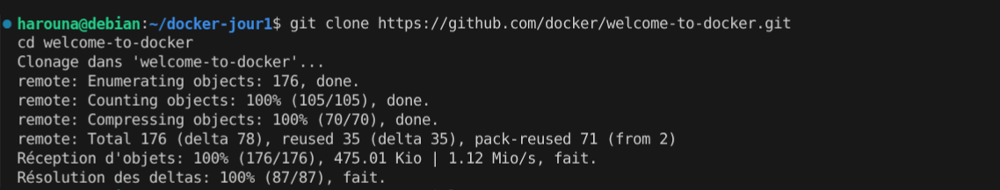
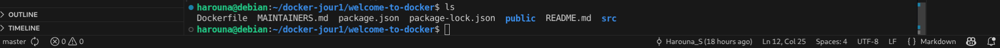
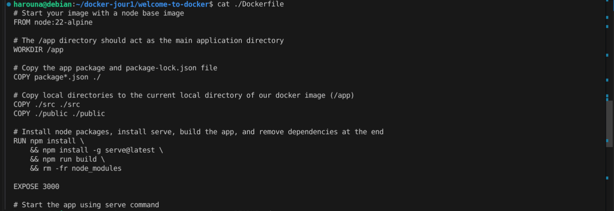
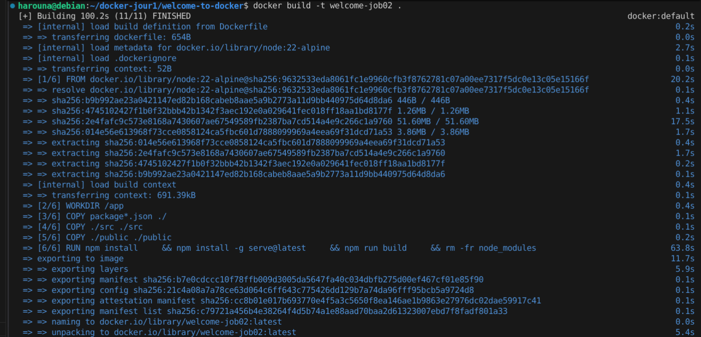
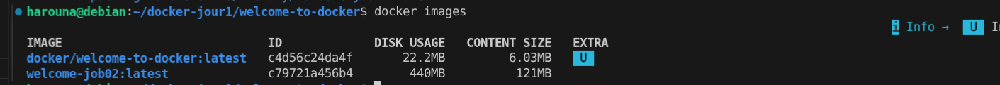

# Jour 1 - Job 02 - Docker
Welcome to Docker - Part 2

## 1. Clonage du projet
Le projet a été cloné depuis le dépôt GitHub officiel de Docker.

Commande utilisée :
`git clone https://github.com/docker/welcome-to-docker.git`

Résultat :

## 2. Analyse des fichiers du projet
Après le clonage, les fichiers du projet ont été consultés afin de comprendre leur rôle.

Commande utilisée :
`ls`

Résultat :

## 3. Analyse du Dockerfile
Le fichier Dockerfile définit les étapes nécessaires à la construction de l’image Docker de l’application.  
Il précise notamment l’image de base utilisée, la copie des fichiers du projet et le lancement du serveur.

Commande utilisée :
`cat Dockerfile`

Résultat :

## 4. Consultation du README du projet
Le fichier README.md du projet a été consulté afin de comprendre le fonctionnement général de l’application.

Commande utilisée :
`cat README.md`

Résultat :

## 5. Création de l’image Docker
Une image Docker a été créée à partir du Dockerfile présent dans le projet.

Commande utilisée :
`docker build -t welcome-job02 .`

Résultat :

## 6. Vérification des images Docker
La liste des images Docker a été vérifiée afin de confirmer la création de la nouvelle image.

Commande utilisée :
`docker images`

Résultat :

## 7. Lancement du container Docker
Le container Docker a été lancé à partir de l’image créée précédemment.

Commande utilisée :
`docker run -it --rm -p 8081:3000 welcome-job02`

Résultat :

## 8. Accès à l’application via le navigateur
L’application est accessible depuis un navigateur web à l’adresse suivante :

`http://localhost:8081`

Résultat :

## 9. Vérification du container en cours d’exécution
La commande suivante permet de vérifier que le container est bien en cours d’exécution.

Commande utilisée :
`docker ps`

Résultat :

## 10. Modification du code de l’application
Une modification a été effectuée dans le code source de l’application depuis Visual Studio Code afin de tester la prise en compte des changements.

Résultat :

## 11. Compréhension de la non-prise en compte des modifications
Les modifications ne sont pas visibles immédiatement car l’image Docker a été construite avant les changements du code.  
Il est nécessaire de reconstruire l’image Docker pour que les modifications soient prises en compte dans le container.

## 12. Reconstruction de l’image Docker
L’image Docker a été reconstruite afin d’intégrer les modifications du code.

Commandes utilisées :
`docker build -t welcome-job02 .`  

Résultat :

## 13. Publication de l’image sur Docker Hub
L’image Docker a été publiée sur Docker Hub afin de la rendre disponible à d’autres utilisateurs.

Commandes utilisées :
`docker login`  

Résultat :

