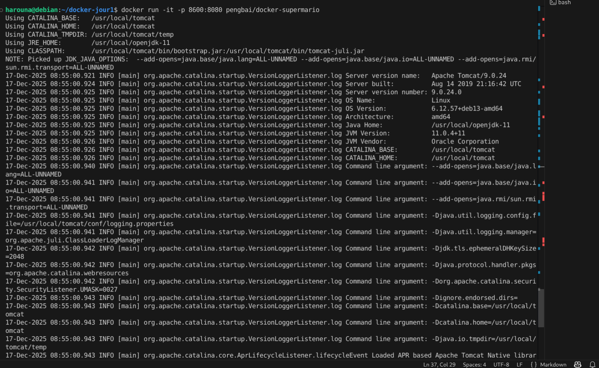
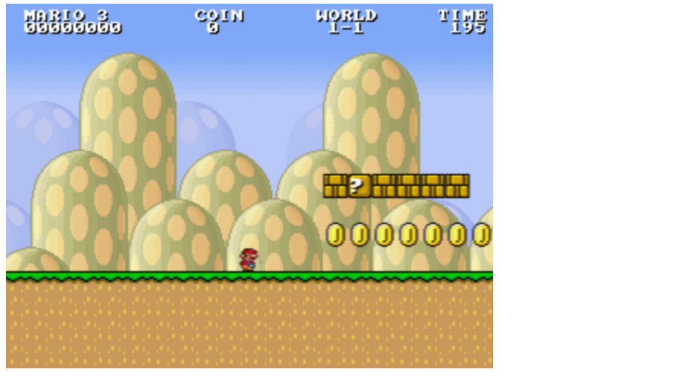

# Jour 1 – Job 03 – Docker  

### Exécution d’un jeu Super Mario avec Docker
Bienvenue dans ce job 03 où nous allons utiliser Docker pour exécuter un jeu Super Mario.
## Recherche de l’image Docker

La recherche de l’image Super Mario a été effectuée à l’aide de la commande suivante :
docker search supermario

Résultat :

## Création du container Docker
Le container Docker a été créé à partir de l’image trouvée précédemment.
Commande utilisée :
`docker run -it --rm -p 8080:8080 thomasmargaux/supermario`

Résultat :

## Accès au jeu via le navigateur
Le jeu Super Mario est accessible depuis un navigateur web à l’adresse suivante :
`http://localhost:8080`
Résultat :

## Arrêt du container Docker
Le container Docker a été arrêté en utilisant la combinaison de touches `CTRL + C`.
Résultat :

## Fin du job 03
Merci pour votre attention !