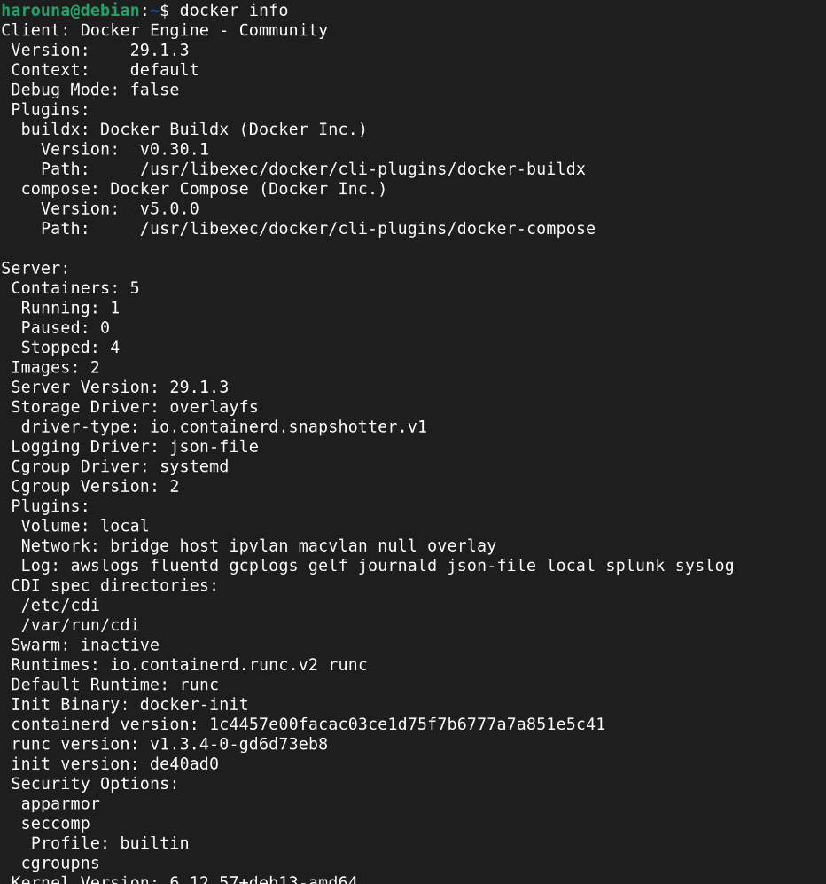

# Jour 1 - Docker

## 1. Vérification de Docker
Commande : `docker --version`  
Résultat : 

## 2.  Informations générales sur Docker
Commande : `docker info`  
Résultat : 

## 3. Liste des conteneurs 
Commande : `docker ps`  
Résultat : 

## 4.  Liste des images Docker 
Commande : `docker images`  
Résultat : 

## 5. Test des commandes docker run et stop
Commande : `docker run`  
Résultat : 

Commande : `docker stop`  
Résultat : 

## 6. Téléchargement d’une image Docker
Commande : `docker pull`  
Résultat : 

## 7. Vérification des images téléchargées
Commande : `docker images`  
Résultat : 

## 8. Construction et lancement du container
Commande :
`docker run -it --rm -p 8080:80 docker/getting-started`

Cette commande permet de lancer un container Docker à partir de l’image `docker/getting-started`.

- `-it` : mode interactif
- `--rm` : suppression automatique du container à l’arrêt
- `-p 8080:80` : redirection du port 80 du container vers le port 8080 de la machine locale

Résultat :

## 9. Accès au container via le navigateur
Une fois le container lancé, l’application est accessible depuis un navigateur web à l’adresse suivante :

`http://localhost:8080`

Résultat :

## 10. Vérification des commandes Docker pendant l'exécution du container
Commande :
`docker ps`

Cette commande permet de vérifier que le container est bien en cours d’exécution.

Résultat :

## 11. Arrêt du container
Commande :
`docker stop <container_id>`

Cette commande permet d’arrêter un container en cours d’exécution.

Résultat :

## 12. Suppression du container
Commande :
`docker rm <container_id>`

Cette commande permet de supprimer un container arrêté.

## 13. Suppression de l’image Docker
Commande :
`docker rmi docker/getting-started`

Cette commande permet de supprimer l’image Docker de la machine locale.

Résultat :

## 14. Exemples de commandes de suppression Docker

### Supprimer un conteneur spécifique
`docker rm <container_id>`

### Supprimer plusieurs conteneurs
`docker rm <id1> <id2> <id3>`

### Supprimer tous les conteneurs arrêtés
`docker container prune`

### Forcer la suppression d’un conteneur actif
`docker rm -f <container_id>`

### Supprimer une image spécifique
`docker rmi <image_name>`

### Supprimer plusieurs images
`docker rmi <image1> <image2>`

### Supprimer toutes les images inutilisées
`docker image prune -a`

### Supprimer toutes les images non utilisées
`docker image prune -a`

### Forcer la suppression d’une image
`docker rmi -f <image_name>`

