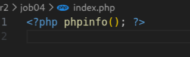
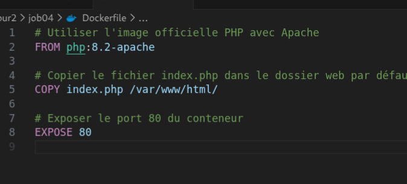
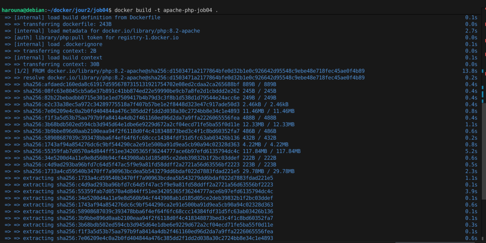
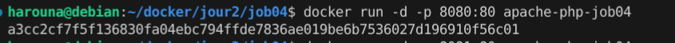
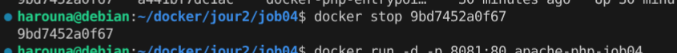
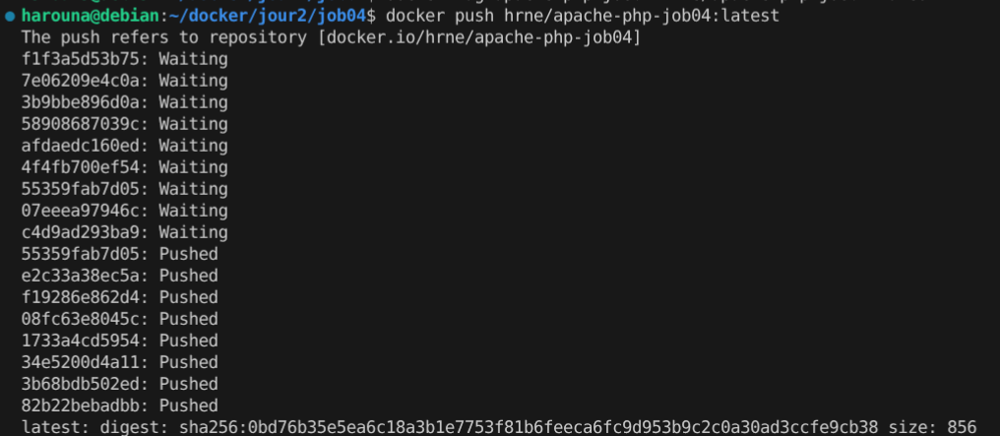

# Jour 2 – Job 04 – Docker Apache

### Exécution d’un serveur Apache avec PHP dans Docker

Résultat :  

---

## Création du Dockerfile

Résultat :  

---

## Construction de l’image Docker

Résultat :  

---

## Lancement du container Docker

Résultat :  

---

## Accès à l’application via le navigateur

Adresse :  
http://localhost:8081/

Résultat :  

---

## Arrêt du container Docker

Résultat :  

---

## Publication de l’image sur Docker Hub

Résultat :  

---

## Fin du job 04
Merci pour votre attention !