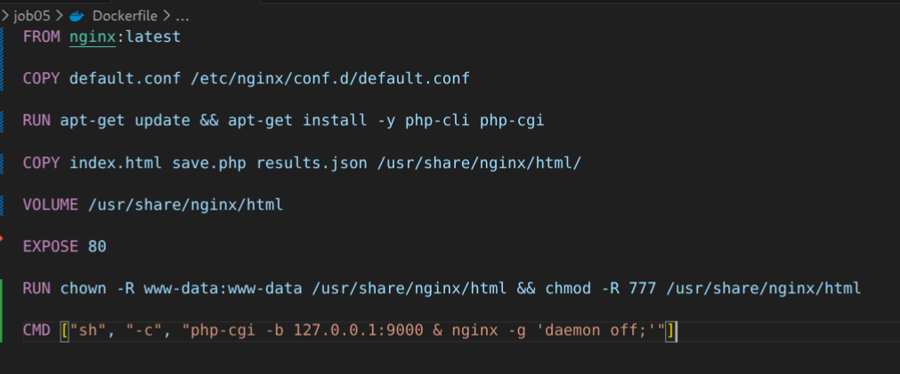
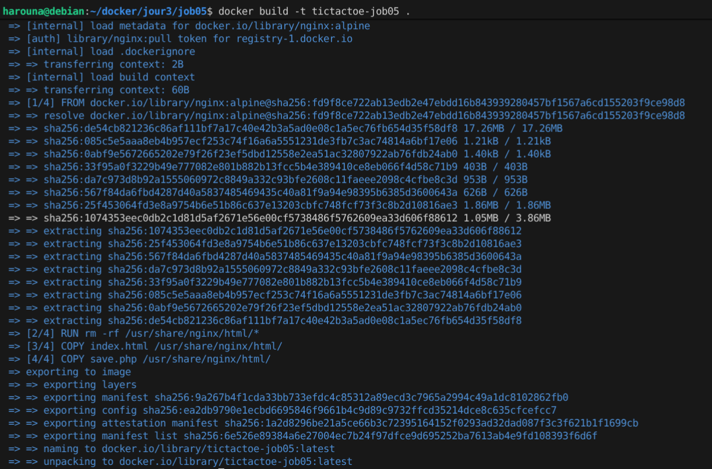

# jour 3 - job05 - morpion

## Création du Dockerfile

Résultat :  

---

## Construction de l’image Docker

Résultat :  

---

## docker volume create morpion-results

Resultat :
![] (images/volume.png)

---

## Lancement du container Docker

Resultat : 
! [] (images/docker-run.png)

---

## Arrêt du container Docker

Resultat :
![] (images/docker_stop-morpion-container.png)
